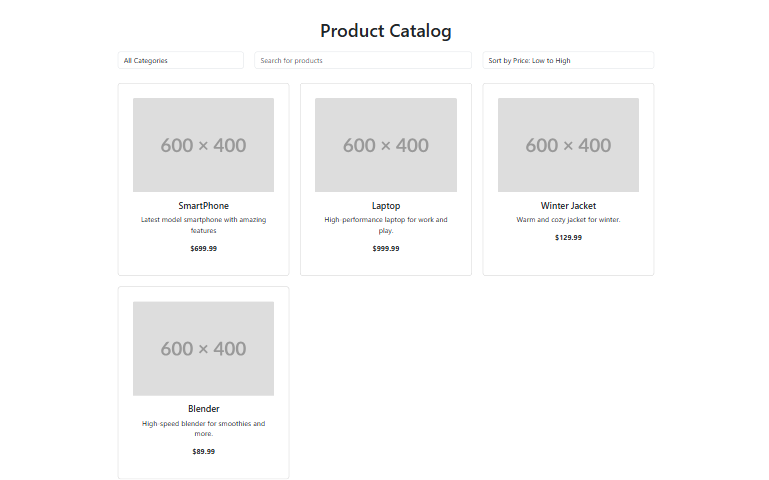

# 🛍️ Product Catalog App

A full-stack product catalog web application built with:

- **Backend:** Spring Boot (JDK 24), Spring Data JPA, H2 Database
- **Frontend:** React (Vite), Bootstrap
- **Features:** Category filtering, product search, sorting by price, responsive UI, REST API with unit tests, Dockerized deployment

---

## 📸 Features

✅ View all products  
✅ Filter by category  
✅ Search by name, description, or category name  
✅ Sort by price (ascending or descending)  
✅ Responsive React UI  
✅ Unit tests for services and controllers  
✅ Docker-ready Spring Boot backend with embedded H2 DB  
## 📸 UI Preview



---

## 🏗️ Project Structure

### 🔧 Backend (Spring Boot)

- `ProductController`: REST endpoints for listing, searching, sorting, and filtering products.
- `ProductService`: Business logic including `searchAndSort`.
- `ProductRepository`: Extends `JpaRepository` & `JpaSpecificationExecutor` for dynamic queries.
- `CategoryController` & `CategoryService`: Manage product categories.
- `H2 Database`: Used in-memory during development; can be file-based in production.

### 🎨 Frontend (React)

- `App.jsx`: Main UI layout with search, category dropdown, and sort selector.
- `CategoryFilter.jsx`: Dropdown filter by category.
- `ProductList.jsx`: Responsive product cards with fallback image.
- Fetches data dynamically from the backend API.

---

## 🧪 Unit Tests

### ✅ ProductServiceTest

- Tests `showAllProducts`, `showAllProductsByCategory`, `searchAndSort`
- Uses mocked `ProductRepository`

### ✅ ProductControllerTest

- Tests `/api/products`, `/api/products/category/{id}`, `/api/products/search`

### ✅ CategoryControllerTest

- Tests `/api/categories` for success and no-content

> All test classes use `@WebMvcTest` or `@ExtendWith(MockitoExtension.class)`  
> Responses and service logic are fully covered.

---

## 🚀 Run Locally

### 🖥️ Backend (Spring Boot)

```bash
# Build the backend
mvn clean package

# Run Spring Boot app
java -jar target/your-app-name.jar
````

> App runs on `http://localhost:8080`

---

### 🌐 Frontend (React)

```bash
cd frontend
npm install
npm run dev
```

> Frontend runs on `http://localhost:5173`

Make sure the backend is running before you open the frontend.

---

## 🐳 Docker Deployment

### 🛠 Dockerfile

```dockerfile
FROM openjdk:17-jdk-slim
WORKDIR /app
COPY target/*.jar app.jar
EXPOSE 8080
ENTRYPOINT ["java", "-jar", "app.jar"]
```

### 🏗️ Build & Run

```bash
# Build Docker image
docker build -t product-catalog-app .

# Run container
docker run -p 8080:8080 product-catalog-app
```

> H2 is embedded and requires no external database container.

---

## ⚙️ API Endpoints

### 📦 Products

* `GET /api/products` – List all products
* `GET /api/products/category/{id}` – Filter by category
* `GET /api/products/search?keyword=...&sort=asc|desc` – Search & sort

### 📁 Categories

* `GET /api/categories` – List all categories

---

## 📚 Technologies Used

* **Spring Boot** + Spring Data JPA + H2
* **React** (Vite)
* **Bootstrap** (UI Styling)
* **Mockito + JUnit 5** (Unit Testing)
* **Docker**

---

## ✍️ Author

**Fateme Soleymanian**
[LinkedIn](https://www.linkedin.com/in/fateme-soleymanian-b2713a225) • [GitHub](https://github.com/fatemesoleymanian) • [Portfolio](https://dark-cake-0993.on.fleek.co/)

---

## 🪪 License

This project is licensed under the MIT License.